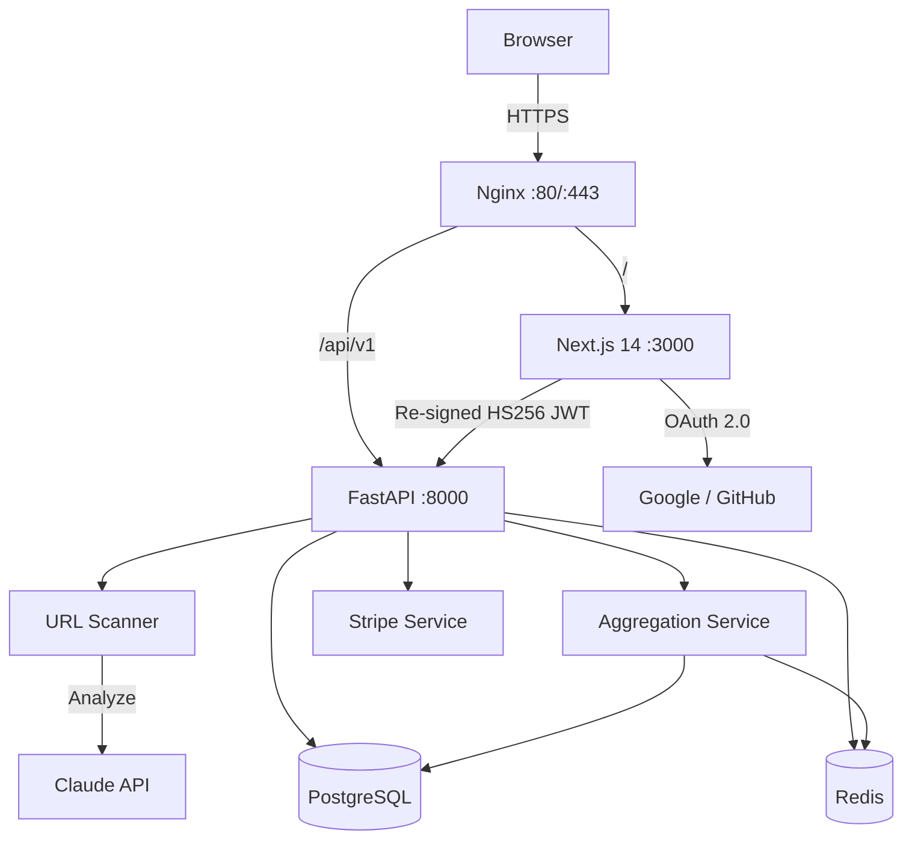

# deadinternet.report

> **Real-time dashboard tracking how much of the internet is AI-generated.**
> Bloomberg Terminal aesthetic meets Dead Internet Theory — backed by real data.

[](https://opensource.org/licenses/MIT)
[](.github/workflows/ci.yml)
[](backend/tests/)
[](https://www.docker.com/)
[](https://fastapi.tiangolo.com/)
[](https://nextjs.org/)
[](docs/Security.md)
[](docs/Security.md)

---

## What is this?

A data-driven dashboard that aggregates **published research** about AI-generated content, bot traffic, and synthetic media across the internet. Not speculation — sourced numbers from Europol, Imperva/Thales, Ahrefs, Cloudflare, and more.

Premium tiers include a **live URL scanner** powered by Claude AI that estimates how likely a page's content was AI-generated, plus **personal analytics** with domain insights and scan trends.

### Key findings

| Metric | Value | Source |
|--------|-------|--------|
| Bot traffic (global) | **51%** | Imperva/Thales Bad Bot Report 2024 |
| New pages with AI content | **74.2%** | Ahrefs bot_or_not study (900k pages) |
| New articles AI-written | **50.3%** | Graphite SEO study (65k URLs) |
| X/Twitter bot accounts | **~59%** | Internal estimates + Mashable |
| Projected synthetic content 2026 | **90%** | Europol |

---

## Quick Start

### Prerequisites

- Docker & Docker Compose v2+
- API keys (see [Configuration](#configuration))

### Deploy in 4 commands

```bash
git clone https://github.com/nabz0r/deadinternet.report.git
cd deadinternet.report
cp .env.example .env   # ← Edit with your API keys
# Generate required secrets:
export JWT_SECRET=$(openssl rand -hex 32)
export INTERNAL_API_SECRET=$(openssl rand -hex 32)
export NEXTAUTH_SECRET=$(openssl rand -base64 32)
docker compose up -d
```

Open `http://localhost` — you're live.

---

## Architecture

Full architecture documentation with Mermaid diagrams: **[docs/ARCHITECTURE.md](docs/ARCHITECTURE.md)**



### Auth flow

NextAuth.js encrypts JWTs as JWE (A256GCM). The backend uses python-jose which can't decrypt JWE. The solution:

```
Browser → NextAuth (JWE token) → Next.js API Proxy → re-sign as HS256 JWT → FastAPI backend
```

The proxy at `/api/backend/[...path]` handles this transparently. The shared secret is `JWT_SECRET` (not NEXTAUTH_SECRET — they are separate keys since the security audit fix).

### Tech stack

| Layer | Technology | Role |
|-------|-----------|------|
| Frontend | Next.js 14 (App Router) | Dashboard, auth, analytics, Stripe checkout |
| Styling | Tailwind CSS + custom theme | Bloomberg Terminal aesthetic |
| Auth | NextAuth.js v4 | Google/GitHub SSO, JWT sessions |
| Backend | FastAPI (async Python) | REST API, business logic |
| Database | PostgreSQL 16 | Users, scans, subscriptions, aggregates, domain stats |
| Cache | Redis 7 | Rate limiting, stats cache, scan result cache, live analytics |
| AI Scanner | Claude API (Anthropic) | URL content analysis |
| Aggregation | Custom pipeline | Daily rollups, DII calculation, domain analytics |
| Payments | Stripe | Subscription management |
| Proxy | Nginx | TLS termination, routing, rate limiting |
| CI/CD | GitHub Actions | Lint, test, build on every push |
| Deploy | Docker Compose | One-command orchestration |

---

## Features

### Dashboard
- **Dead Internet Index** — composite score blending research data (70%) with live scan results (30%)
- **Responsive gauge** — SVG circular gauge with pulse glow for critical levels (>70%), ARIA `role="meter"`
- **Timeline chart** — Recharts area chart (2014-2026) with projected data markers
- **Platform breakdown** — per-platform bot/AI percentages
- **Ticker tape** — scrolling facts sourced from research + dynamic insights from scan data
- **Manual refresh** — real-time stats reload with timestamp
- **Skip-to-content** link and full keyboard accessibility

### URL Scanner (Hunter+)
- **Claude AI-powered** analysis of web page content
- **Cmd/Ctrl+K** keyboard shortcut for quick access
- **Progress bar** with ARIA attributes and loading states
- **Scan caching** — identical URLs return cached results (configurable TTL)
- **Verdict display** with shared color/label helpers

### Scan History (Hunter+)
- **Search** by URL
- **Filter** by verdict (human/mixed/AI generated)
- **Sort** by date or AI probability
- Fully typed with `useMemo` client-side filtering

### Analytics Dashboard (Hunter+)
- **Personal metrics** — total scans, monthly count, average AI probability
- **Verdict breakdown** — visual progress bars with percentages
- **Top domains** — ranked by scan count with AI rate indicators
- **Activity chart** — 30-day scan activity with per-day hover tooltips
- **Global statistics** — platform-wide scan summary, top domains, detection rates
- **Live insights** — dynamic facts generated from aggregated scan data

### Data Aggregation
- **Daily rollups** — scan data aggregated by verdict per day (`scan_aggregates` table)
- **Domain statistics** — per-domain scan counts, verdict breakdown, AI rates (`domain_stats` table)
- **Dynamic Dead Internet Index** — weighted formula: `DII = (research * 0.7) + (live_scans * 0.3)`
- **Volume trends** — daily scan volume for charting
- **Dynamic ticker facts** — auto-generated from scan data

### Accessibility
- `prefers-reduced-motion` media query support
- ARIA roles: `meter`, `progressbar`, `marquee`, `status`
- `aria-live` regions for dynamic content
- Screen reader text for ticker tape
- Skip-to-content links
- Firefox scrollbar styling

---

## Testing

The backend has a comprehensive test suite (75 tests) covering security, API, rate limiting, scanner logic, aggregation, and user analytics. Tests use async SQLite and FakeRedis — no external services required.

```bash
cd backend
pip install -r requirements-test.txt
JWT_SECRET=test-secret INTERNAL_API_SECRET=test-secret python -m pytest tests/ -v
```

### What's tested

| Suite | Tests | Covers |
|-------|-------|--------|
| `test_security.py` | 10 | JWT auth, tier enforcement, token edge cases, internal sync |
| `test_scanner_service.py` | 24 | SSRF protection (IP ranges, DNS), prompt injection filtering |
| `test_stats_api.py` | 5 | Public stats endpoints, Redis caching |
| `test_rate_limiter.py` | 5 | Per-tier scan limits, ghost tier blocking |
| `test_aggregation.py` | 26 | Daily aggregates, domain stats, DII calculation, ticker generation, full pipeline, API endpoints, stats blending |
| `test_user_analytics.py` | 7 | User analytics endpoint, domain grouping, monthly counts, user isolation, recent activity |

### CI/CD

GitHub Actions runs on every push (`.github/workflows/ci.yml`):
1. **Backend** — lint with ruff, run full pytest suite
2. **Frontend** — lint with ESLint, production build
3. **Docker** — verify docker compose builds cleanly

---

## Security

A comprehensive security audit was performed on Feb 8, 2026 — see **[docs/Security.md](docs/Security.md)**.

**All 7 critical vulnerabilities have been fixed:**

| # | Vulnerability | Status |
|---|---------------|--------|
| C1 | `/users/sync` publicly accessible | Fixed — X-Internal-Secret header |
| C2 | JWT secret hardcoded to "change-me" | Fixed — Startup validation, crashes if weak |
| C3 | SSRF in URL scanner | Fixed — IP blocklist + DNS resolution check |
| C4 | Prompt injection via web content | Fixed — Content sanitization + explicit instruction |
| C5 | No error handling on Claude JSON | Fixed — try/except + validation + fallback |
| C6 | Missing security headers | Fixed — CSP, HSTS, X-Frame-Options, etc. |
| C7 | Weak JWT validation | Fixed — require_sub, require_exp, claim validation |

Additionally fixed: proxy path whitelist (E4), CSP headers (E5), JWT_SECRET separation (E10), structured request logging (M10).

### Additional hardening

- **CSP** — `unsafe-eval` removed from Content-Security-Policy; `X-Powered-By` header disabled
- **Nginx** — HTTPS redirect, TLS 1.2+, security headers (HSTS, X-Frame-Options, X-Content-Type-Options, Referrer-Policy)
- **Docker Compose** — Redis password authentication enabled
- **IP rate limiting** — 60 req/min per IP at application level (configurable via `IP_RATE_LIMIT` / `IP_RATE_WINDOW`)
- **Stripe idempotency** — checkout sessions use idempotency keys; webhooks deduplicated via Redis (48h TTL)
- **Webhook error handling** — internal errors logged, never exposed to Stripe
- **Request logging** — structured middleware logging method, path, status, and duration for every request (skips health checks)

---

## Database

### Models

| Table | Key fields | Constraints |
|-------|-----------|-------------|
| `users` | email (unique), tier, stripe_customer_id | `CHECK tier IN (ghost, hunter, operator)` |
| `scans` | user_id (FK CASCADE), url, ai_probability, verdict | `CHECK verdict IN (human, mixed, ai_generated)`, `CHECK ai_probability 0.0-1.0` |
| `subscriptions` | user_id (FK CASCADE, unique), stripe_subscription_id, status, tier | `CHECK status IN (active, canceled, past_due, trialing, incomplete, incomplete_expired)` |
| `scan_aggregates` | date, verdict, scan_count, avg/min/max ai_probability, tokens, duration | Unique on `(date, verdict)` |
| `domain_stats` | domain (unique), scan_count, verdict counts, avg_ai_probability | www-stripped domain normalization |

### Indexes

- `users.email` (unique), `users.stripe_customer_id`
- `scans.user_id`, `scans.url`, `scans(user_id, created_at)` composite for history queries
- `subscriptions.user_id` (unique), `subscriptions.stripe_subscription_id` (unique), `subscriptions.stripe_price_id`
- `scan_aggregates(date, verdict)` unique composite
- `domain_stats.domain` unique

### Connection pool

- `pool_size=20`, `max_overflow=10`
- `pool_pre_ping=True` — detects stale connections before use
- `pool_recycle=3600` — recycles connections after 1 hour

### Cascade behavior

Deleting a user automatically deletes all associated scans and subscription records, both at the ORM level (`cascade="all, delete-orphan"`) and at the database level (`ON DELETE CASCADE`).

### Migrations

Alembic manages schema migrations:

| Migration | Description |
|-----------|-------------|
| `001_initial_schema` | Users, scans, subscriptions tables with indexes and constraints |
| `002_add_aggregation_tables` | scan_aggregates and domain_stats tables for data aggregation |

```bash
# Apply migrations
docker compose exec backend alembic upgrade head

# Create a new migration after model changes
docker compose exec backend alembic revision --autogenerate -m "description"
```

---

## Configuration

Copy `.env.example` to `.env` and fill in your values.

### Required secrets (generate these!)

```bash
# These are MANDATORY — the app will crash without them
JWT_SECRET=$(openssl rand -hex 32)              # Backend JWT signing
INTERNAL_API_SECRET=$(openssl rand -hex 32)     # Frontend <-> Backend internal auth
NEXTAUTH_SECRET=$(openssl rand -base64 32)      # NextAuth session encryption
```

### Required API keys

| Variable | Where to get it | Required for |
|----------|----------------|---------------|
| `GOOGLE_CLIENT_ID` | [Google Cloud Console](https://console.cloud.google.com/apis/credentials) | Google login |
| `GOOGLE_CLIENT_SECRET` | Same | Google login |
| `GITHUB_CLIENT_ID` | [GitHub Developer Settings](https://github.com/settings/developers) | GitHub login |
| `GITHUB_CLIENT_SECRET` | Same | GitHub login |
| `ANTHROPIC_API_KEY` | [Anthropic Console](https://console.anthropic.com/settings/keys) | URL scanner |
| `STRIPE_SECRET_KEY` | [Stripe Dashboard](https://dashboard.stripe.com/test/apikeys) | Payments |
| `STRIPE_WEBHOOK_SECRET` | Stripe CLI or Dashboard | Webhook verification |
| `STRIPE_PRICE_HUNTER` | Stripe Products -> Price ID | Hunter tier ($9/mo) |
| `STRIPE_PRICE_OPERATOR` | Stripe Products -> Price ID | Operator tier ($29/mo) |

### Optional / defaults

| Variable | Default | Description |
|----------|---------|-------------|
| `POSTGRES_USER` | `deadinet` | DB username |
| `POSTGRES_PASSWORD` | `deadinet` | DB password (**change in prod**) |
| `REDIS_PASSWORD` | `changeme` | Redis password (**change in prod**) |
| `NEXTAUTH_URL` | `http://localhost:3000` | Public frontend URL |
| `DEBUG` | `false` | Enables `/docs` and `/redoc` endpoints |
| `IP_RATE_LIMIT` | `60` | Max requests per IP per window |
| `IP_RATE_WINDOW` | `60` | Rate limit window in seconds |
| `SCAN_CACHE_TTL` | `86400` | Scan result cache duration (seconds) |
| `STATS_CACHE_TTL` | `3600` | Dashboard stats cache duration (seconds) |

---

## Pricing Tiers

| Feature | Ghost (Free) | Hunter ($9/mo) | Operator ($29/mo) |
|---------|:---:|:---:|:---:|
| Public dashboard | Yes | Yes | Yes |
| Global stats | Yes | Yes | Yes |
| Historical timeline | Yes | Yes | Yes |
| Live URL scanner | — | 10/day | Unlimited |
| Scan history | — | Yes | Yes |
| Personal analytics | — | Yes | Yes |
| API access (token) | — | — | Yes |
| Bulk URL analysis | — | — | Yes |
| Priority support | — | — | Yes |

---

## API Reference

Full docs: **[docs/API.md](docs/API.md)** | Interactive: `/docs` (when DEBUG=true)

### Public endpoints
```
GET  /api/v1/stats/           → Full dataset (blended with live scan data)
GET  /api/v1/stats/platforms  → Platform breakdown
GET  /api/v1/stats/timeline   → Historical data 2014-2026
GET  /api/v1/stats/ticker     → Ticker tape facts
GET  /api/v1/stats/index      → Dead Internet Index
GET  /api/v1/stats/analytics  → Global scan analytics + DII + domain rankings
GET  /api/v1/stats/domains    → Top scanned domains (sortable)
GET  /api/v1/stats/volume     → Scan volume trend (daily)
GET  /health                  → Deep health check (DB + Redis)
```

### Authenticated (Hunter+)
```
POST /api/v1/scanner/scan     → Analyze a URL
GET  /api/v1/scanner/usage    → Daily scan usage
GET  /api/v1/scanner/history  → Scan history (paginated, validated)
GET  /api/v1/users/me/analytics → Personal scan analytics
```

### User management
```
GET  /api/v1/users/me         → Profile
POST /api/v1/users/sync       → Internal: sync from NextAuth
POST /api/v1/users/checkout   → Stripe checkout (idempotent)
POST /api/v1/users/portal     → Billing portal
```

### Internal
```
POST /api/v1/stats/aggregate  → Trigger aggregation pipeline (X-Internal-Secret required)
```

### Health check

`GET /health` verifies database and Redis connectivity. Returns `200` when healthy, `503` when degraded:

```json
{
  "service": "deadinternet-api",
  "database": "ok",
  "redis": "ok",
  "status": "healthy"
}
```

---

## Project Structure

```
.
├── docker-compose.yml
├── .env.example
├── .github/
│   └── workflows/
│       └── ci.yml              # CI: lint, test, build, docker
├── docs/
│   ├── ARCHITECTURE.md         # Mermaid diagrams, flow charts
│   ├── Security.md             # Audit report + fix status
│   ├── API.md                  # Endpoint documentation
│   └── DEPLOYMENT.md           # VPS deployment guide
│
├── frontend/                   # Next.js 14
│   └── src/
│       ├── app/
│       │   ├── page.tsx            # Landing (SSR)
│       │   ├── login/              # Google/GitHub SSO
│       │   ├── pricing/            # Tier comparison + SEO metadata
│       │   ├── dashboard/          # Main dashboard (lazy-loaded)
│       │   │   ├── history/        # Scan history (Hunter+)
│       │   │   ├── analytics/      # Personal + global analytics (Hunter+)
│       │   │   └── success/        # Post-checkout
│       │   └── api/
│       │       ├── auth/           # NextAuth handler
│       │       └── backend/        # API proxy (JWT re-sign)
│       ├── components/
│       │   ├── layout/             # Header, Footer, MobileNav
│       │   ├── dashboard/          # Gauge, Charts, Scanner, etc.
│       │   ├── landing/            # HeroCounter, LivePulse
│       │   └── ui/                 # Toast, Skeleton, ErrorBoundary
│       ├── lib/
│       │   ├── auth.ts             # NextAuth config
│       │   ├── api-client.ts       # Type-safe API client
│       │   ├── verdict.ts          # Shared verdict display helpers
│       │   └── constants.ts        # Tier definitions
│       └── types/
│           ├── api.ts              # API response type definitions
│           └── next-auth.d.ts      # NextAuth type augmentation
│
├── backend/                    # FastAPI
│   ├── tests/                  # pytest test suite (75 tests)
│   │   ├── conftest.py             # Async fixtures, FakeRedis
│   │   ├── test_security.py        # JWT, auth, tier enforcement
│   │   ├── test_scanner_service.py # SSRF, prompt injection
│   │   ├── test_stats_api.py       # Stats endpoints
│   │   ├── test_rate_limiter.py    # Scan rate limits
│   │   ├── test_aggregation.py     # Aggregation pipeline, DII, domains
│   │   └── test_user_analytics.py  # User analytics endpoint
│   ├── alembic/
│   │   └── versions/
│   │       ├── 001_initial_schema.py       # Initial migration
│   │       └── 002_add_aggregation_tables.py  # Aggregation tables
│   └── app/
│       ├── core/
│       │   ├── config.py           # Settings + secret validation
│       │   ├── security.py         # JWT decode + auth + internal auth
│       │   ├── database.py         # Async SQLAlchemy + pool config
│       │   ├── redis.py            # Redis client wrapper
│       │   └── rate_limiter.py     # Per-user scan limits
│       ├── middleware/
│       │   ├── ip_rate_limit.py    # IP-based rate limiting
│       │   └── request_logging.py  # Structured request logging
│       ├── models/
│       │   ├── user.py             # User model
│       │   ├── scan.py             # Scan model
│       │   ├── subscription.py     # Subscription model
│       │   └── aggregation.py      # ScanAggregate + DomainStats models
│       ├── schemas/
│       │   └── user.py             # Pydantic schemas (profile, analytics)
│       ├── services/
│       │   ├── scanner_service.py  # SSRF protection + Claude + caching
│       │   ├── stats_service.py    # Research data + live blending
│       │   ├── aggregation_service.py  # DII calculation + domain analytics
│       │   └── stripe_service.py   # Checkout + idempotent webhooks
│       └── api/v1/
│           ├── stats.py            # Public + analytics endpoints
│           ├── scanner.py          # Auth + rate limited + validated
│           ├── users.py            # Sync + billing + user analytics
│           └── webhooks.py         # Stripe receiver (deduped)
│
├── nginx/                      # Reverse proxy (HTTPS + security headers)
└── scripts/                    # Utilities
```

---

## Development

```bash
# Full stack with Docker
docker compose up -d
docker compose logs -f

# Rebuild after changes
docker compose build && docker compose up -d

# Reset everything
docker compose down -v && docker compose up -d

# Run backend tests locally
cd backend
pip install -r requirements-test.txt
JWT_SECRET=test-secret INTERNAL_API_SECRET=test-secret python -m pytest tests/ -v

# DB migrations
docker compose exec backend alembic upgrade head
docker compose exec backend alembic revision --autogenerate -m "description"

# Trigger data aggregation manually
curl -X POST http://localhost:8000/api/v1/stats/aggregate \
  -H "X-Internal-Secret: YOUR_INTERNAL_API_SECRET"
```

---

## Documentation

| Document | Description |
|----------|-------------|
| [docs/ARCHITECTURE.md](docs/ARCHITECTURE.md) | Architecture diagrams, auth flow, data model, component tree |
| [docs/Security.md](docs/Security.md) | Security audit report, vulnerability status, remediation timeline |
| [docs/API.md](docs/API.md) | API endpoint reference with examples |
| [docs/DEPLOYMENT.md](docs/DEPLOYMENT.md) | Production deployment guide (VPS, SSL, DNS) |
| [CONTRIBUTING.md](CONTRIBUTING.md) | Contribution guidelines |

---

## License

MIT — see [LICENSE](LICENSE).

---

<p align="center">
  <strong>The internet is 67% dead. This dashboard proves it.</strong><br/>
  <a href="https://deadinternet.report">deadinternet.report</a>
</p>
