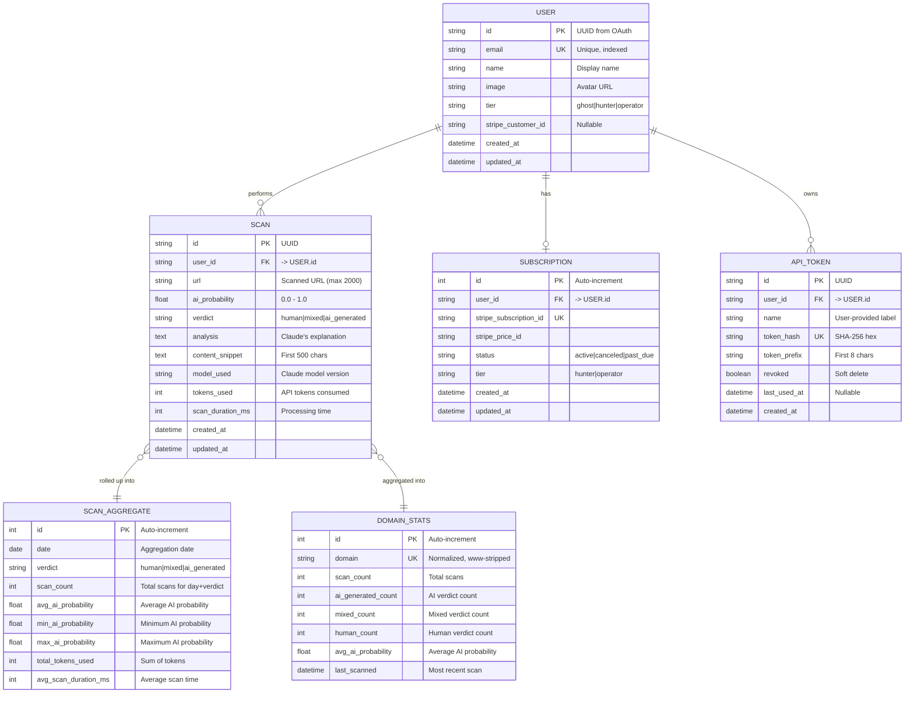

# Architecture — deadinternet.report

> Overview of the architecture, data flows, and technical decisions.

---

## Overview


---

## Authentication Flow

The auth flow is non-standard because NextAuth.js encrypts its JWTs as JWE (A256GCM),
which cannot be decoded on the Python side. Solution: the Next.js proxy re-signs tokens as HS256.


---

## Scanner Flow


---

## Data Aggregation Flow


---

## Stripe Payment Flow


---

## Data Model



---

## Route Structure


---

## Middleware Stack

Middleware executes in reverse order of registration (last added = first executed):

```
Request → RequestLoggingMiddleware → IPRateLimitMiddleware → CORS → FastAPI Router → Response
```

| Middleware | Purpose |
|-----------|---------|
| `RequestLoggingMiddleware` | Logs method, path, status, duration; adds `X-Request-Duration-Ms` header |
| `IPRateLimitMiddleware` | Per-IP rate limiting (60 req/min) via Redis sliding window |
| `CORSMiddleware` | Cross-origin request handling |

---

## Security Stack


---

## Frontend Components


---

## Environment Variables


